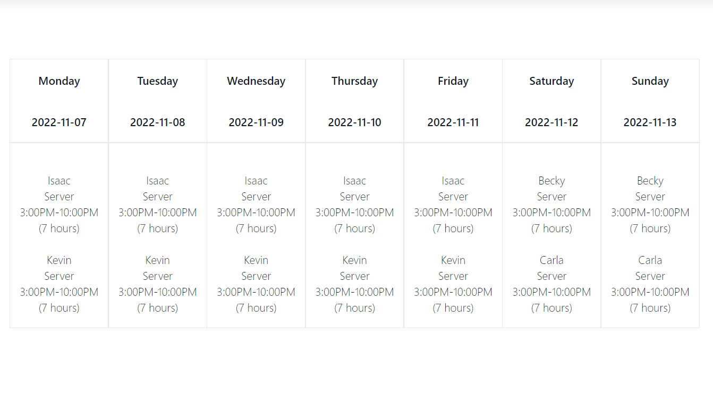

<h1 align="center">ScheduleMaker</h1>
<h3 align="center">v0.1.0</h3>

  <p align="center">
    A webtool designed to help your small business keep track of your employee's schedules!
    <!-- <br />
    <a href="https://github.com/isaaclee12/ScheduleMaker"><strong>Explore the docs »</strong></a>
    <br />
    <br />
    <a href="https://github.com/isaaclee12/ScheduleMaker">View Demo</a>
    ·
    <a href="https://github.com/isaaclee12/ScheduleMaker/issues">Report Bug</a>
    ·
    <a href="https://github.com/isaaclee12/ScheduleMaker/issues">Request Feature</a> -->
  </p>
  <a href="https://github.com/isaaclee12/ScheduleMaker" align="center">
    
  </a>
</div>


<!-- TABLE OF CONTENTS -->
<!-- <details> -->
  <!-- <summary>Table of Contents</summary> -->
  <ol>
    <!-- <li>
      <a href="#about-the-project">About The Project</a>
      <ul>
      </ul>
    </li> -->
    <li><a href="#built-with">Built With</a></li>
    <li><a href="#prerequisites">Prerequisites</a></li>
    <li><a href="#installation">Installation</a></li>
    </li>
    <!-- <li><a href="#usage">Usage</a></li> -->
    <li><a href="#roadmap">Roadmap</a></li>
    <li><a href="#contributing">Contributing</a></li>
    <li><a href="#license">License</a></li>
    <li><a href="#contact">Contact</a></li>
    <!-- <li><a href="#acknowledgments">Acknowledgments</a></li> -->
  </ol>
<!-- </details> -->


<!-- ABOUT THE PROJECT -->
## About The Project
- ScheduleMaker is a CRUD application designed to help employers easily manage their staff's schedules.
- ScheduleMaker uses industry standard technologies like React, Django, and SQL, to securely manage and store scheduling data
<p align="right">(<a href="#readme-top">back to top</a>)</p> -->


### Built With

* [![React][React.js]][React-url]
* [![Django][Django]][Django-url]
* [![MySQL][MySQL]][MySQL-url]

<p align="right">(<a href="#readme-top">back to top</a>)</p>

## Prerequisites
* Node
* npm
* Django

## Installation

1. Clone the repo
   ```sh
   git clone https://github.com/isaaclee12/ScheduleMaker.git
   ```
2. Run the app (npm install will be performed automatically, and the server and client will be run concurrently)
  ```npm start```

<p align="right">(<a href="#readme-top">back to top</a>)</p>


<!-- USAGE EXAMPLES -->
<!-- ## Usage

Use this space to show useful examples of how a project can be used. Additional screenshots, code examples and demos work well in this space. You may also link to more resources. -->

<!-- <p align="right">(<a href="#readme-top">back to top</a>)</p> -->


<!-- ROADMAP -->
## Roadmap

- PHASE 1: CRUD App Completion
  - Bugs to fix:
    - TODO: Delete function not deleting certain items
    - TODO: DatePicker and Fontawesome symbols appearing over NavBar

  - Upload basic CRUD App to Cyclic

- PHASE 2: Dates + Glow Up
  - Refactor the code to have better code patterns.
  - Create dummy data for future weeks so the app just works.
  - Add date-fns features to have a front page that stays at the current week.
  - Add ability to go between weeks
  - Aesthetics:
    - Mobile responsiveness
    - Better CSS please!
  - Deploy to cyclic

- PHASE 3: Authentication & Data Cleaning
  - Implement Basic JWT Authentication for a single account
  - Add change password/change email system
  - Add Roles System
  - Have one admin account and a few employee accounts
  - Have schedules displayed based on who's logged in
  - Document the whole thing down to the last line, for your own reference later when you make another CRUD app
  - Deploy to Cyclic - THIS IS MVP


- Phase 4: (Optional) Add availability, time off, and other features
  - Add availability (2 weeks out, for employees, any for managers)
  - Add time off (2 weeks out, for employees, any for managers)
  - Add other features in notebook

See the [open issues](https://github.com/isaaclee12/ScheduleMaker/issues) for a full list of proposed features (and known issues).

<p align="right">(<a href="#readme-top">back to top</a>)</p>


<!-- CONTRIBUTING -->
## Contributing

Contributions are what make the open source community such an amazing place to learn, inspire, and create. Any contributions you make are **greatly appreciated**.

If you have a suggestion that would make this better, please fork the repo and create a pull request. You can also simply open an issue with the tag "enhancement".
Don't forget to give the project a star! Thanks again!

1. Fork the Project
2. Create your Feature Branch (`git checkout -b feature/AmazingFeature`)
3. Commit your Changes (`git commit -m 'Add some AmazingFeature'`)
4. Push to the Branch (`git push origin feature/AmazingFeature`)
5. Open a Pull Request

<p align="right">(<a href="#readme-top">back to top</a>)</p>


<!-- LICENSE -->
## License

Distributed under the MIT License. See `LICENSE.txt` for more information.

<p align="right">(<a href="#readme-top">back to top</a>)</p>


<!-- CONTACT -->
## Contact

Isaac Lee - [@isaaclee12](https://twitter.com/isaacwonhalee) - isaac.wonha.lee@outlook.com

Project Link: [https://github.com/isaaclee12/ScheduleMaker](https://github.com/isaaclee12/ScheduleMaker)

<p align="right">(<a href="#readme-top">back to top</a>)</p>

<!-- MARKDOWN LINKS & IMAGES -->
<!-- https://www.markdownguide.org/basic-syntax/#reference-style-links -->
[contributors-shield]: https://img.shields.io/github/contributors/isaaclee12/ScheduleMaker.svg?style=for-the-badge
[contributors-url]: https://github.com/isaaclee12/ScheduleMaker/graphs/contributors
[forks-shield]: https://img.shields.io/github/forks/isaaclee12/ScheduleMaker.svg?style=for-the-badge
[forks-url]: https://github.com/isaaclee12/ScheduleMaker/network/members
[stars-shield]: https://img.shields.io/github/stars/isaaclee12/ScheduleMaker.svg?style=for-the-badge
[stars-url]: https://github.com/isaaclee12/ScheduleMaker/stargazers
[issues-shield]: https://img.shields.io/github/issues/isaaclee12/ScheduleMaker.svg?style=for-the-badge
[issues-url]: https://github.com/isaaclee12/ScheduleMaker/issues
[license-shield]: https://img.shields.io/github/license/isaaclee12/ScheduleMaker.svg?style=for-the-badge
[license-url]: https://github.com/isaaclee12/ScheduleMaker/blob/master/LICENSE.txt
[linkedin-shield]: https://img.shields.io/badge/-LinkedIn-black.svg?style=for-the-badge&logo=linkedin&colorB=555
[linkedin-url]: https://linkedin.com/in/isaac-lee-621873133
[product-screenshot]: images/screenshot.png
[Next.js]: https://img.shields.io/badge/next.js-000000?style=for-the-badge&logo=nextdotjs&logoColor=white
[Next-url]: https://nextjs.org/
[React.js]: https://img.shields.io/badge/React-20232A?style=for-the-badge&logo=react&logoColor=61DAFB
[React-url]: https://reactjs.org/
[Django]: https://img.shields.io/badge/Django-20232A?style=for-the-badge&logo=django&logoColor=077A2E
[Django-url]: https://www.djangoproject.com/
[MySQL]: https://img.shields.io/badge/MySQL-20232A?style=for-the-badge&logo=mysql&logoColor=00FFE1
[MySQL-url]: https://www.mysql.com/

## About the Data:

- id (int): ID of row 
- day_of_week (string): Day of the week the shift occurs, e.g. Monday, Tuesday, etc. 
- date (date): The date the shift occurs in ISO 8601 format, e.g. 2000-01-01
- name (string): The name of the employee who is working the shift
- position (string): The position that the employee will be working in
- location (string): The location of the store. Useful if a business has multiple locations.
- start_time (string): The starting time of the shift.
- end_time (string): The ending time of the shift.
- total_hours (int): The duration of the shift in hours. Should equal the time between start_time and  end_time.

<p align="right">(<a href="#readme-top">back to top</a>)</p>
